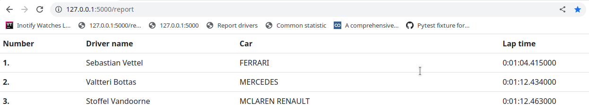
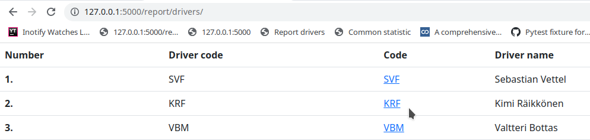
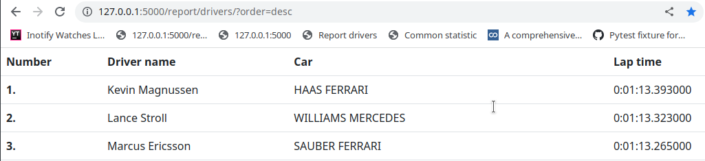
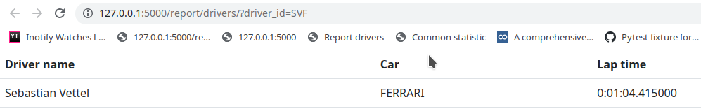

# Task 7 - Web report of Monaco 2018 Racing


### Install
````
 python -m pip install --upgrade pip
 python -m pip install -r requirements.txt
 folder road_data must be placed in one directory with run.py
````
### 

### Run Debug mode
````
FLASK_ENV=development flask run
````
### 

### Normal run 
````
flask run
````
### 


## Examples:
#### http://127.0.0.1:5000/report


#### http://127.0.0.1:5000/drivers/


#### http://127.0.0.1:5000/drivers/?order=desc


#### http://127.0.0.1:5000/drivers/driver_id=SVF


